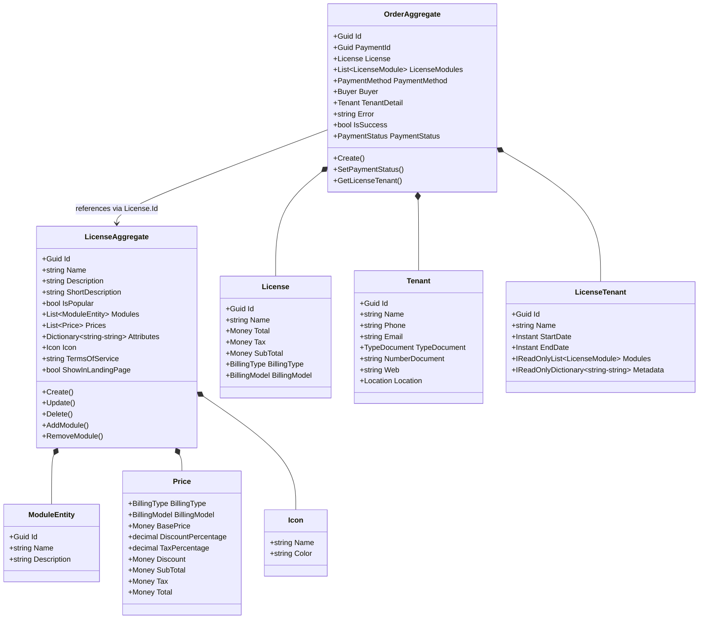
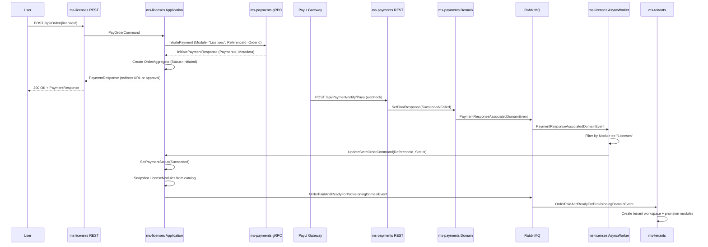
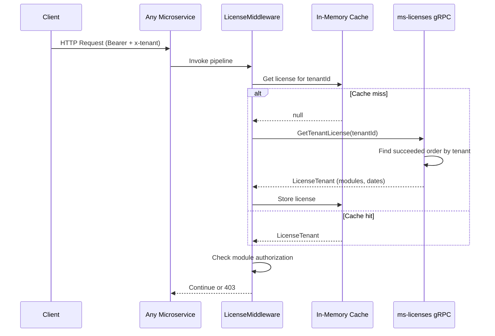

# Licenses Microservice

## Overview

The Licenses microservice manages the platform's subscription catalog and the end-to-end license purchase flow. It defines tiered license plans (Free, Basic, Premium, Ultimate), each containing a set of platform modules, pricing strategies, and custom attributes. When a user selects a plan and completes payment, this service orchestrates the creation of an Order, delegates payment processing to ms-payments via gRPC, listens for the asynchronous payment result, and upon success emits the provisioning event that causes ms-tenants to create a new tenant workspace. Additionally, the service exposes a gRPC endpoint consumed by the SDK security middleware (LicenseMiddleware) to hydrate the tenant license cache at runtime.

## Business Context

A multi-tenant SaaS platform requires a mechanism to control which features each tenant can access. In this platform, that mechanism is the License: a curated bundle of modules with associated billing terms. Prospective customers browse the pricing page (served by the anonymous License endpoints), choose a plan, provide payment details, and submit an order. The payment is processed externally by the Payments microservice through a gateway (PayU). Once the gateway confirms success via webhook, the Payments service publishes a domain event. The Licenses service consumes that event, verifies it belongs to its own module context ("Licenses"), updates the order to Succeeded, and publishes the `OrderPaidAndReadyForProvisioningDomainEvent` that carries the tenant workspace details and the purchased license snapshot. Downstream, ms-tenants creates the workspace and provisions the modules.

For a new developer: think of Licenses as the "storefront + order desk." It shows what plans are available, takes the order, hands the payment to the cashier (ms-payments), and once the receipt comes back, tells the warehouse (ms-tenants) to set up the workspace.

## Ubiquitous Language

| Term | Definition |
| --- | --- |
| License | A subscription tier (e.g., "Basic", "Premium") that bundles a set of platform modules with pricing and billing terms. Represents the catalog entry, not an individual tenant subscription. |
| Order | A purchase transaction binding a buyer to a specific license. Captures immutable snapshots of the license details, modules, buyer information, payment method, and tenant workspace to be provisioned. |
| Module | A discrete functional capability of the platform (e.g., "Invoicing", "Parking", "CommonAreas"). Modules are the authorization atoms referenced by the RBAC and LicenseMiddleware layer. |
| Price | A value object defining the financial terms of a license: billing type, billing model, base price, discount percentage, tax percentage, and computed subtotal/tax/total. |
| BillingType | The billing cadence: None (free/trial), Monthly, or Annually. Determines the license validity duration (30 or 365 days). |
| BillingModel | The pricing strategy: FlatRate, PerUser, PerActiveUser, PerUnit, PerGroup, UsageBased, TieredUsage, PerFeature, Hybrid, Custom, or None. |
| Icon | A visual identifier for a license tier, consisting of a name (icon key) and a hex color code. |
| Buyer | A snapshot of the purchasing user's identity and contact information at the moment of purchase. |
| Tenant | A value object capturing the workspace details (name, phone, email, document, location) of the organization to be provisioned upon successful payment. |
| LicenseTenant | An immutable snapshot of the license constraints assigned to a tenant: license ID, name, start/end dates, included modules, and metadata. Used by the gRPC service and LicenseMiddleware. |
| LicenseModule | A snapshot of a module included in a purchased license: ID, name, and description. The ID serves as the authorization key used by domain microservices. |
| PaymentStatus | The lifecycle state of an order's payment: Unknown, Initiated, Succeeded, Failed, Expired, or Pending. |
| Seed | The background service that creates the four default license tiers on first startup if no licenses exist in the database. |
| PaymentResponse | The gateway response returned to the buyer immediately after payment initiation (e.g., redirect URL for PSE, approval status for credit card). |
| Provisioning | The downstream process triggered by `OrderPaidAndReadyForProvisioningDomainEvent` where ms-tenants creates the workspace and domain microservices seed their data. |

## Domain Model

The Licenses domain is organized around two aggregates. `LicenseAggregate` represents a catalog entry (a subscription tier) with its modules, pricing options, icon, attributes, and terms of service. `OrderAggregate` represents a purchase transaction that tracks the payment lifecycle and, upon success, generates the provisioning event. Value objects embedded within these aggregates ensure immutability of financial snapshots and module lists at the moment of purchase.

## Data Dictionary

### LicenseAggregate

The catalog entry for a subscription tier. Managed by platform administrators. Displayed on the public pricing page when `ShowInLandingPage` is true.

| Field | Type | Description |
| --- | --- | --- |
| Id | Guid | Unique identifier of the license tier |
| Name | string | Display name (e.g., "Basic", "Premium", "Ultimate") |
| Description | string | Full description of what the license includes |
| ShortDescription | string | Brief summary for UI cards and pricing tables |
| IsPopular | bool | Highlights the license as "recommended" in the pricing UI |
| Modules | List\<ModuleEntity\> | Platform modules included in this license tier |
| Prices | List\<Price\> | Available pricing options (one per BillingType+BillingModel+Currency combination) |
| Attributes | Dictionary\<string, string\> | Custom key-value metadata (e.g., "Tier": "Basic", "TrialDays": "20") |
| Icon | Icon | Visual identifier: icon name and hex color |
| TermsOfService | string | Legal terms specific to this license tier |
| ShowInLandingPage | bool | Whether to display on the public pricing page |
| IsActive | bool | Soft-delete / availability flag |
| CreatedBy | Guid | User who created the license |
| CreatedAt | Instant | UTC timestamp of creation |
| UpdatedBy | Guid? | User who last modified the license |
| UpdatedAt | Instant? | UTC timestamp of last modification |

### Price (Value Object)

Embedded within LicenseAggregate. Defines one pricing option. A license may have multiple prices (e.g., monthly and annually). Uniqueness is enforced by the combination of Currency + BillingModel + BillingType.

| Field | Type | Description |
| --- | --- | --- |
| BillingType | BillingType | Cadence: None, Monthly, or Annually |
| BillingModel | BillingModel | Strategy: FlatRate, PerUser, PerActiveUser, PerUnit, PerGroup, UsageBased, TieredUsage, PerFeature, Hybrid, Custom, or None |
| BasePrice | Money | Original price before discounts (amount in minor units + ISO 4217 currency) |
| DiscountPercentage | decimal | Discount to apply (e.g., 16.0 for 16%) |
| TaxPercentage | decimal | Tax rate to apply (e.g., 19.0 for 19% IVA) |
| Discount | Money | Computed: BasePrice * (DiscountPercentage / 100) |
| SubTotal | Money | Computed: BasePrice - Discount |
| Tax | Money | Computed: SubTotal * (TaxPercentage / 100) |
| Total | Money | Computed: SubTotal + Tax |

### OrderAggregate

Represents a single purchase transaction. Created when a user submits payment for a license. Immutable snapshots of the license, modules, buyer, and tenant ensure historical accuracy.

| Field | Type | Description |
| --- | --- | --- |
| Id | Guid | Unique identifier of the order |
| PaymentId | Guid | Identifier of the payment record in ms-payments |
| License | License (VO) | Immutable snapshot of the purchased license financial details |
| LicenseModules | List\<LicenseModule\> | Modules included at purchase time (populated on Succeeded) |
| PaymentMethod | PaymentMethod | Payment instrument used (credit card, PSE, etc.) |
| Buyer | Buyer | Snapshot of the buyer's identity at purchase time |
| TenantDetail | Tenant (VO) | Workspace details for provisioning upon success |
| Error | string? | Error message if payment or processing failed |
| IsSuccess | bool | True when PaymentStatus transitions to Succeeded |
| PaymentStatus | PaymentStatus | Current payment lifecycle state |
| IsActive | bool | Soft-delete flag |
| CreatedBy | Guid | User who placed the order |
| CreatedAt | Instant | UTC timestamp of creation |
| UpdatedAt | Instant? | UTC timestamp of last status change |

### License (Value Object)

Embedded within OrderAggregate. Immutable financial snapshot of the license at purchase time.

| Field | Type | Description |
| --- | --- | --- |
| Id | Guid | Original catalog license ID |
| Name | string | License name at purchase time |
| Total | Money | Final amount including taxes |
| Tax | Money | Tax amount |
| SubTotal | Money | Amount before taxes |
| BillingType | BillingType | Monthly or Annually (determines validity: 30 or 365 days) |
| BillingModel | BillingModel | Pricing strategy at purchase time |

### Tenant (Value Object)

Embedded within OrderAggregate. Carries the organization details needed by ms-tenants to create the workspace.

| Field | Type | Description |
| --- | --- | --- |
| Id | Guid | Pre-assigned tenant identifier |
| Name | string | Organization name (max 124 chars) |
| Phone | string | Contact phone (7-15 digits, optional + prefix) |
| Email | string | Contact email (validated format) |
| TypeDocument | TypeDocument | Type of legal identification document |
| NumberDocument | string | Legal identification number |
| Web | string? | Organization website URL (optional, validated) |
| Location | Location | Geographic location (country, city, address) |

### LicenseTenant (Value Object)

Returned by the gRPC service and embedded in provisioning events. Captures the exact modules the tenant purchased.

| Field | Type | Description |
| --- | --- | --- |
| Id | Guid | License tier identifier |
| Name | string | License name (1-128 alpha chars) |
| StartDate | Instant | License validity start (payment success timestamp) |
| EndDate | Instant | License validity end (start + 30 or 365 days based on BillingType) |
| Modules | IReadOnlyList\<LicenseModule\> | Purchased modules (Id, Name, Description) |
| Metadata | IReadOnlyDictionary\<string, string\> | Additional metadata from the payment gateway |

### Enumerations Reference

**BillingType:** None (free/trial), Monthly, Annually

**BillingModel:** None, FlatRate, PerUser, PerActiveUser, PerUnit, PerGroup, UsageBased, TieredUsage, PerFeature, Hybrid, Custom

**PaymentStatus:** Unknown, Initiated, Succeeded, Failed, Expired, Pending

## License Seed (Default Tiers)

On first startup, the `LicenseSeedService` creates four default license tiers if the database is empty. All prices use COP (Colombian Peso) in minor units via `Money.FromLong()`. The annual plans include a 16% discount. All plans have 19% tax (IVA).

| Tier | Modules | Monthly Price | Annual Price | Attributes |
| --- | --- | --- | --- | --- |
| Free | All 14 modules | $0 (BillingType.None) | N/A | TrialDays=20 |
| Basic | 6 Core + 3 Financial = 9 modules | $150,000 COP | $1,500,000 COP (-16%) | Tier=Basic |
| Premium | 9 Basic + 3 Premium = 12 modules | $350,000 COP | $3,500,000 COP (-16%) | Tier=Premium |
| Ultimate | All 14 modules | $500,000 COP | $5,000,000 COP (-16%) | Tier=Ultimate |

Module groups: Core (Organization, Phases, Blocks, Towers, Units, Residents), Financial (Accounting, Invoicing, Administration), Premium (CommonAreas, Parking, Deposits), Ultimate-only (LeaseAgreements, Vehicles).

## Payment Flow

The license purchase follows a choreography-based saga pattern. The Licenses microservice initiates payment by calling the Payments gRPC service, then waits asynchronously for the gateway response. The payment gateway (PayU) processes the transaction and notifies ms-payments via webhook. Upon confirmation, ms-payments publishes the `PaymentResponseAssociatedDomainEvent` which ms-licenses consumes, filters by module ("Licenses"), and updates the order status accordingly.

## gRPC Service

The `LicenseGrpcService` exposes a single RPC method consumed by the SDK security middleware (`LicenseMiddleware`) running in every other microservice. When a request arrives at any authenticated endpoint, the middleware checks its local cache for the tenant's license. On cache miss, it calls this gRPC service to retrieve the license snapshot including the list of authorized modules. The middleware then caches the result and enforces module-level access control.

**GetTenantLicense RPC:**
- Input: `tenantId` (string, parsed as Guid)
- Output: `GetTenantLicenseResponse` containing LicenseId, Name, StartDate, EndDate, Modules[], and Metadata map
- The response is built from the succeeded Order's `GetLicenseTenant()` method, which computes validity dates based on BillingType (Monthly = 30 days, Annually = 365 days from order creation)

## Event Catalog

### Events Consumed

The AsyncWorker subscribes to domain events from the Payments microservice via RabbitMQ. The routing is achieved through the `[EventKey]` attribute and queue naming conventions.

| Event | Source | Consumer | Action |
| --- | --- | --- | --- |
| `PaymentResponseAssociatedDomainEvent` | ms-payments | `UpdateOrderHandler` | Filters by Module=="Licenses", maps ReferenceId to OrderId, updates payment status. On Succeeded: snapshots modules, emits provisioning event |

### Events Produced

| Event | Trigger | Consumers | Purpose |
| --- | --- | --- | --- |
| `LicenseCreatedDomainEvent` | `LicenseAggregate.Create()` | Internal / Audit | A new license tier was added to the catalog |
| `LicenseUpdatedDomainEvent` | `LicenseAggregate.Update()` | Internal / Audit | A license tier was modified |
| `LicenseDeletedDomainEvent` | `LicenseAggregate.Delete()` | Internal / Audit | A license tier was soft-deleted |
| `LicenseModuleAddedDomainEvent` | `LicenseAggregate.AddModule()` | Internal / Audit | A module was added to a license tier |
| `LicenseModuleRemovedDomainEvent` | `LicenseAggregate.RemoveModule()` | Internal / Audit | A module was removed from a license tier |
| `OrderPaidAndReadyForProvisioningDomainEvent` | `OrderAggregate.SetPaymentStatus(Succeeded)` | ms-tenants | Carries TenantDetail + LicenseTenant snapshot; triggers workspace creation and module provisioning |

## API Reference

Base path: `/api`

### License (Catalog Management)

Public-facing endpoints for browsing the license catalog (anonymous) and admin endpoints for CRUD operations on license tiers (authenticated).

| Method | Path | Description | Auth |
| --- | --- | --- | --- |
| GET | `/api/License` | Paginated list of licenses (supports Criteria filtering) | Anonymous |
| GET | `/api/License/{id}` | Get a license tier by ID | Anonymous |
| POST | `/api/License` | Create a new license tier | Bearer |
| POST | `/api/License/{id}/module` | Add a module to a license tier | Bearer |
| PUT | `/api/License/{id}` | Update a license tier | Bearer |
| DELETE | `/api/License/{id}` | Soft-delete a license tier | Bearer |
| DELETE | `/api/License/{id}/module/{idModule}` | Remove a module from a license tier | Bearer |

### Order (Purchase Flow)

Endpoints for managing the purchase lifecycle. Users browse their orders and initiate payment for a chosen license.

| Method | Path | Description | Auth |
| --- | --- | --- | --- |
| GET | `/api/Order` | Paginated list of the authenticated user's orders | Bearer |
| GET | `/api/Order/{id}` | Get a specific order by ID | Bearer |
| POST | `/api/Order/{id}` | Initiate payment for a license (id = license ID) | Bearer |

### gRPC

| Service | Method | Description | Callers |
| --- | --- | --- | --- |
| LicenseService | GetTenantLicense | Returns the license snapshot for a tenant | LicenseMiddleware (all microservices) |

All REST endpoints return RFC 7807 Problem Details on error. List responses use `Pagination<T>`.

## Key Design Decisions

- **Immutable purchase snapshots:** The Order stores frozen copies (License VO, LicenseModules, Buyer, Tenant) at purchase time. Subsequent changes to the catalog do not affect existing orders or provisioned tenants.

- **Module-based routing for payments:** The `Module` field ("Licenses") in the payment request allows ms-payments to serve multiple consuming microservices through a single gateway. The consuming service filters events by its own module string.

- **gRPC for synchronous license queries:** The LicenseMiddleware needs sub-millisecond responses to avoid degrading request latency. gRPC with in-memory caching provides the optimal balance of freshness and speed.

- **Computed validity from BillingType:** License validity (StartDate to EndDate) is calculated at payment success time: Monthly = 30 days, Annually = 365 days. No separate renewal aggregate exists yet.

- **Duplicate pricing strategy guard:** A license cannot have two prices with the same Currency + BillingModel + BillingType combination, enforced by a domain guard at creation and update time.

- **Idempotent seed:** The `LicenseSeedService` checks whether any license exists before seeding. This prevents duplicates on pod restarts or deployments.

- **All prices in minor units (long):** Monetary values use the shared `Money` value object (amount as long in minor units + ISO 4217 currency code) to avoid floating-point precision issues.

- **Choreography over orchestration:** The payment saga uses event-driven choreography rather than a centralized orchestrator. Each service reacts to events from its predecessors, reducing coupling.

## Related Microservices

| Microservice | Direction | Integration Point |
| --- | --- | --- |
| Payments | Outbound (gRPC) / Inbound (event) | gRPC `InitiatePayment` to start payment; consumes `PaymentResponseAssociatedDomainEvent` for result |
| Tenants | Outbound (event) | Produces `OrderPaidAndReadyForProvisioningDomainEvent` to trigger workspace creation |
| All microservices | Inbound (gRPC) | Serves `GetTenantLicense` to LicenseMiddleware for module authorization |
