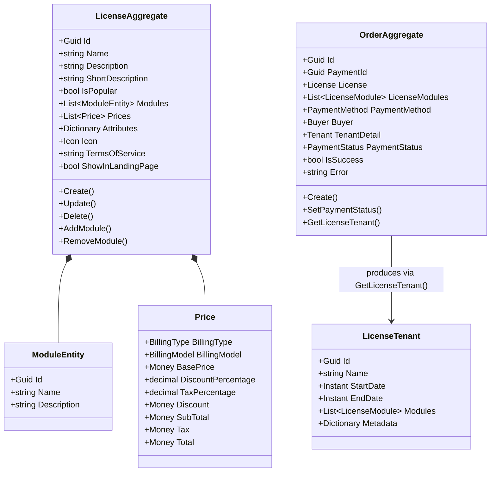
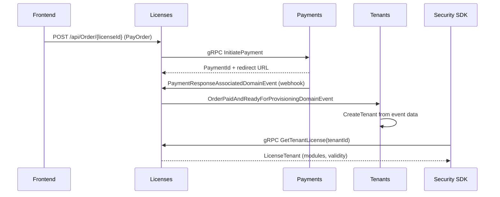

# Licenses Microservice

## Overview

The Licenses microservice manages the SaaS licensing catalog and the purchase order lifecycle for the platform. It defines license tiers (with their included modules, pricing strategies, and billing models), processes purchase orders through payment gateways, and upon successful payment emits a provisioning event that triggers tenant creation downstream. It also exposes a gRPC service (`GetTenantLicense`) consumed by the Security SDK's `LicenseMiddleware` to determine which modules a tenant has access to at runtime.

## Business Context

Any multi-tenant SaaS platform needs a mechanism to define what each customer has paid for and what features they can access. Without a centralized licensing system, access control would be scattered across individual microservices, pricing logic would be duplicated, and the onboarding flow (purchase to provisioning) would lack orchestration.

The Licenses microservice solves this by being the single authority on "what does a license include and how much does it cost." When a new customer purchases a license, this microservice orchestrates the payment flow and, upon success, emits an event that the Tenants microservice consumes to create the customer's workspace. The immutable snapshot of modules purchased is stored in the order, ensuring that future catalog changes never retroactively affect existing customers.

For a new developer: think of this as the "product catalog and checkout" of the platform itself. It sells the platform to new customers and tells the security layer what each customer is allowed to use.

## Ubiquitous Language

| Term            | Definition                                                                                                                                                |
| --------------- | --------------------------------------------------------------------------------------------------------------------------------------------------------- |
| License         | A purchasable tier or plan that bundles a set of platform modules with specific pricing, billing configuration, and terms of service.                     |
| Module          | A functional capability of the platform (e.g., "Parking", "CommonAreas") that can be included in a license. Each module has an Id, name, and description.|
| Price           | A pricing configuration for a license combining base price, billing type (monthly/annually), billing model (flat rate, per unit, etc.), discount, and tax.|
| BillingType     | The payment frequency: None, Monthly, or Annually. Determines the license validity period upon purchase.                                                  |
| BillingModel    | The pricing strategy: FlatRate, PerUser, PerActiveUser, PerUnit, PerGroup, UsageBased, TieredUsage, PerFeature, Hybrid, Custom, or None.                 |
| Order           | A purchase transaction representing a customer buying a specific license. Tracks payment status from initiation through success or failure.                |
| Buyer           | The person initiating the purchase. Captured as an immutable snapshot in the order for audit purposes.                                                    |
| PaymentMethod   | The payment instrument selected by the buyer (credit card, PSE bank transfer, etc.) for a specific order.                                                 |
| PaymentStatus   | The lifecycle state of a payment: Unknown, Initiated, Succeeded, Failed, Expired, Pending.                                                                |
| LicenseTenant   | An immutable snapshot of the license assigned to a tenant, including validity dates and the exact modules purchased. Used by security middleware.          |
| LicenseModule   | A record within LicenseTenant capturing a module's Id, Name, and Description at the moment of purchase.                                                   |
| Icon            | A visual representation (icon data) associated with a license tier for UI display.                                                                        |
| TermsOfService  | The legal agreement text specific to a license tier that the buyer must accept.                                                                            |
| Attributes      | Custom key-value metadata on a license (e.g., "MaxUsers": "50", "StorageGB": "100") for configurable limits.                                             |
| IsPopular       | A flag indicating the license tier should be highlighted in the pricing UI as recommended.                                                                 |
| ShowInLandingPage | A flag controlling whether the license is visible on the public pricing page.                                                                           |
| Provisioning    | The downstream process triggered by `OrderPaidAndReadyForProvisioningDomainEvent` that creates the tenant workspace and configures modules.               |
| Money           | A value object encapsulating a decimal amount and ISO 4217 currency code for currency-safe arithmetic.                                                    |

## Domain Model

The Licenses domain is organized around two aggregates. The `LicenseAggregate` represents a purchasable license tier with its modules, pricing options, and presentation attributes. The `OrderAggregate` represents a purchase transaction, capturing immutable snapshots of the license, buyer, payment method, and tenant details at the moment of purchase. When payment succeeds, the order captures the exact modules included and emits the provisioning event.

## Data Dictionary

### LicenseAggregate

Represents a purchasable license tier in the platform catalog.

| Field             | Type                      | Description                                                            |
| ----------------- | ------------------------- | ---------------------------------------------------------------------- |
| Id                | Guid                      | Unique identifier of the license tier                                  |
| Name              | string                    | Display name (e.g., "Pro", "Enterprise")                               |
| Description       | string                    | Full detailed description of what the license includes                 |
| ShortDescription  | string                    | Brief summary for UI cards                                             |
| IsPopular         | bool                      | Whether to highlight as recommended in UI                              |
| Modules           | List\<ModuleEntity\>      | Platform modules included in this license                              |
| Prices            | List\<Price\>             | Available pricing configurations (one per billing type/model/currency) |
| Attributes        | Dictionary\<string,string\>| Custom key-value metadata (limits, quotas)                            |
| Icon              | Icon                      | Visual icon for UI display                                             |
| TermsOfService    | string                    | Legal agreement text for this tier                                     |
| ShowInLandingPage | bool                      | Whether visible on public pricing page                                 |
| IsActive          | bool                      | Whether the license is available for purchase                          |
| CreatedBy         | Guid                      | User who created the license                                           |
| CreatedAt         | Instant                   | UTC timestamp of creation                                              |

### OrderAggregate

Represents a purchase transaction for a license.

| Field          | Type                 | Description                                                                    |
| -------------- | -------------------- | ------------------------------------------------------------------------------ |
| Id             | Guid                 | Unique identifier of the order                                                 |
| PaymentId      | Guid                 | Transaction identifier from the payment gateway                                |
| License        | License              | Snapshot of the license purchased (id, name, billing type)                     |
| LicenseModules | List\<LicenseModule\>| Immutable snapshot of modules at purchase time                                 |
| PaymentMethod  | PaymentMethod        | Payment instrument used                                                        |
| Buyer          | Buyer                | Buyer identity snapshot                                                        |
| TenantDetail   | Tenant               | Details for the workspace to be provisioned                                    |
| PaymentStatus  | PaymentStatus        | Current payment state (Initiated, Succeeded, Failed, Expired, Pending)         |
| IsSuccess      | bool                 | Whether the order completed successfully                                       |
| Error          | string?              | Error message if payment failed                                                |
| CreatedBy      | Guid                 | User who initiated the purchase                                                |
| CreatedAt      | Instant              | UTC timestamp of order creation                                                |

### Enumerations Reference

**BillingType:** None, Monthly, Annually

**BillingModel:** None, FlatRate, PerUser, PerActiveUser, PerUnit, PerGroup, UsageBased, TieredUsage, PerFeature, Hybrid, Custom

**PaymentStatus:** Unknown, Initiated, Succeeded, Failed, Expired, Pending

## Integration Architecture

Licenses integrates with the Payments microservice for processing transactions, emits provisioning events consumed by Tenants, and serves gRPC queries from the Security SDK. The purchase flow is: buyer selects license, Licenses creates a payment via gRPC to Payments, Payments processes and emits a response event, Licenses updates the order status, and upon success emits the provisioning event.

## Event Catalog

### Events Consumed

| Event                                    | Source   | Handler               | Action                                          |
| ---------------------------------------- | -------- | --------------------- | ----------------------------------------------- |
| `PaymentResponseAssociatedDomainEvent`   | Payments | `UpdateOrderHandler`  | Updates order payment status; triggers provisioning if succeeded |

### Events Produced

| Event                                           | Trigger                          | Consumers | Purpose                                         |
| ----------------------------------------------- | -------------------------------- | --------- | ----------------------------------------------- |
| `LicenseCreatedDomainEvent`                     | `LicenseAggregate.Create()`     | Internal  | Audit trail for catalog changes                 |
| `LicenseUpdatedDomainEvent`                     | `LicenseAggregate.Update()`     | Internal  | Audit trail for catalog changes                 |
| `LicenseDeletedDomainEvent`                     | `LicenseAggregate.Delete()`     | Internal  | Audit trail for catalog removal                 |
| `LicenseModuleAddedDomainEvent`                 | `LicenseAggregate.AddModule()`  | Internal  | Module added to a license tier                  |
| `LicenseModuleRemovedDomainEvent`               | `LicenseAggregate.RemoveModule()`| Internal | Module removed from a license tier              |
| `OrderPaidAndReadyForProvisioningDomainEvent`   | `OrderAggregate.SetPaymentStatus(Succeeded)` | Tenants | Triggers tenant workspace creation   |

## API Reference

Base path: `/api`

### Licenses

Public catalog of available license tiers. List and detail endpoints are anonymous to allow display on the pricing page.

| Method | Path                          | Description                                   | Auth            |
| ------ | ----------------------------- | --------------------------------------------- | --------------- |
| GET    | `/api/License`                | Paginated list of licenses (anonymous)        | None            |
| GET    | `/api/License/{id}`           | Get a license tier by ID (anonymous)          | None            |
| POST   | `/api/License`                | Create a new license tier                     | Bearer          |
| POST   | `/api/License/{id}/module`    | Add a module to a license                     | Bearer          |
| PUT    | `/api/License/{id}`           | Update a license tier                         | Bearer          |
| DELETE | `/api/License/{id}`           | Soft-delete a license tier                    | Bearer          |
| DELETE | `/api/License/{id}/module/{moduleId}` | Remove a module from a license      | Bearer          |

### Orders

Purchase flow endpoints for authenticated users.

| Method | Path                | Description                                        | Auth    |
| ------ | ------------------- | -------------------------------------------------- | ------- |
| GET    | `/api/Order`        | List orders for the authenticated user (paginated) | Bearer  |
| GET    | `/api/Order/{id}`   | Get order details by ID                            | Bearer  |
| POST   | `/api/Order/{id}`   | Initiate payment for a license (PayOrder)          | Bearer  |

### gRPC Services

| Service          | Method             | Description                                                    |
| ---------------- | ------------------ | -------------------------------------------------------------- |
| LicenseService   | GetTenantLicense   | Returns the license snapshot for a tenant (used by middleware) |

All REST endpoints return RFC 7807 Problem Details on error. List responses use `Pagination<T>`.

## Key Design Decisions

- **Immutable order snapshots:** The order stores a frozen copy of the license, modules, buyer, and payment method at purchase time. Future catalog changes never affect existing customers.

- **gRPC for security middleware:** The `GetTenantLicense` gRPC service is optimized for low-latency calls from the `LicenseMiddleware` that runs on every authenticated request across the platform.

- **Duplicate pricing strategy guard:** A license cannot have two prices with the same combination of currency, billing model, and billing type, enforced by domain guards at creation and update.

- **License validity from billing type:** Monthly licenses are valid for 30 days from purchase; annual licenses for 365 days. Computed from `CreatedAt` plus the duration.

- **Anonymous catalog access:** License listing and detail endpoints do not require authentication, enabling the public pricing page to display tiers without a token.

- **Provisioning decoupled via event:** Rather than calling the Tenants service synchronously, the order emits `OrderPaidAndReadyForProvisioningDomainEvent`, ensuring the purchase completes even if Tenants is temporarily unavailable.

- **Seed data for standard tiers:** The `LicenseSeedService` ensures default license tiers exist on startup, guaranteeing the platform always has at least one purchasable plan.

## Related Microservices

| Microservice  | Direction       | Integration Point                                                                         |
| ------------- | --------------- | ----------------------------------------------------------------------------------------- |
| Payments      | Bidirectional   | Licenses initiates payment via gRPC; Payments emits response event consumed by Licenses   |
| Tenants       | Outbound        | Consumes `OrderPaidAndReadyForProvisioningDomainEvent` to create tenant workspace         |
| Security SDK  | Inbound (gRPC)  | `LicenseMiddleware` calls `GetTenantLicense` to populate license cache per tenant         |
| Modules       | Reference       | License tiers reference module IDs managed by the Modules microservice                    |
